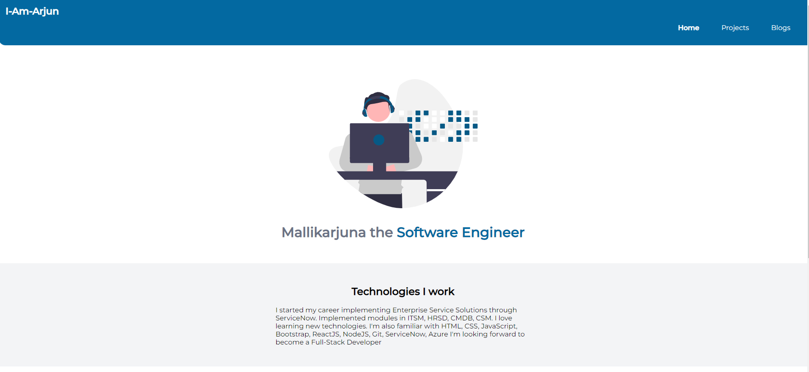

# mark 3 - My Portfolio Site

  

Created a Component library which will be used to build portfolio website. 
Major html tags are explained in this file

* Created my portfolio site
* Showcasing my projects, blogs and social handles
* Know more about me on this site

# Learnings
HTML, CSS, JavaScript, Netlify, Github
